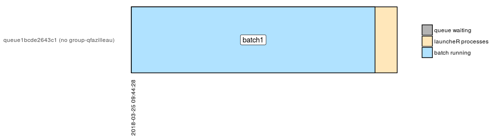
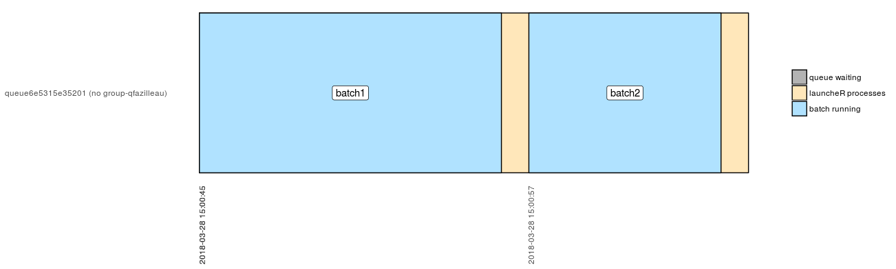
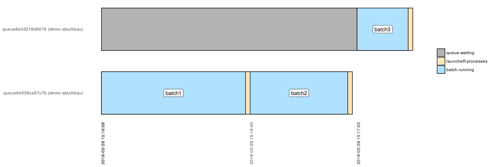
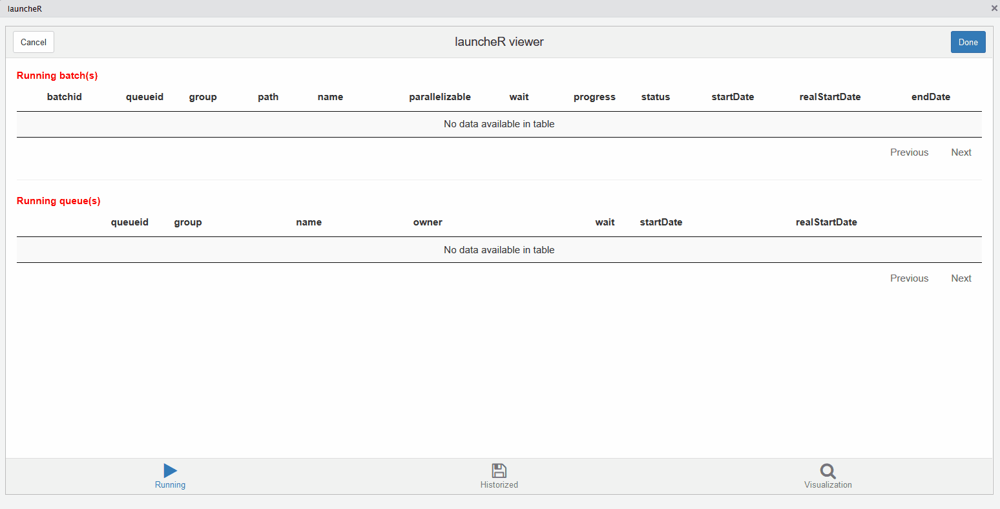

<!-- README.md is generated from README.Rmd. Please edit that file -->

```{r, echo = FALSE}
knitr::opts_chunk$set(
  collapse = TRUE,
  comment = "#>",
  fig.path = "README-"
)
```

## Overview

The goal of launcheR is to easily launch R scripts with the following features :

 * Waiting queue management
 * Easy set of parameters
 * Send processes in background


## Install launcheR

```{r gh-installation, eval = FALSE}
devtools::install_github("qfazille/launcheR")
```

## Quick examples

Create fake batch to run the examples below

````{r, eval = FALSE}
# Create examples batchs
cat("Sys.sleep(30)", file = "batch1.R")
cat("Sys.sleep(20)", file = "batch2.R")
cat("Sys.sleep(10)", file = "batch3.R")
````

Run `batch1.R` with launcheR

````{r, eval = FALSE}
library(launcheR)

# create queue
q <- createQueue()

# Add batchs batch1.R
q <- addBatch(object = q, path = "./batch1.R")

# launch queue
launch(q)
````

````{r, eval = FALSE}
# Visualize last queue
vis(last = 1)
````



## Multiple batch

Run `batch1.R` and then `batch2.R` with launcheR

````{r, eval = FALSE}
q <- createQueue()
q <- addBatch(object = q, path = "./batch1.R")
q <- addBatch(object = q, path = "./batch2.R")
launch(q)
````

````{r, eval = FALSE}
vis(last = 1)
````



## WaitBeforeNext

Run `batch1.R` and `batch2.R` at the same time and then `batch3.R` with launcheR

````{r, eval = FALSE}
q <- createQueue()
q <- addBatch(object = q, path = "./batch1.R", waitBeforeNext = FALSE)
q <- addBatch(object = q, path = "./batch2.R")
q <- addBatch(object = q, path = "./batch3.R")
launch(q)
````

````{r, eval = FALSE}
vis(last = 1)
````


## Group

When creating a queue, you can define a **group**.  

> Only one queue by group can run at the same time

Create 2 queues that belong to the same group and launch them.

````{r, eval = FALSE}
# create 2 queues
q1 <- createQueue(group = "demo")
q2 <- createQueue(group = "demo")

# Add batch1.R & batch2.R in q1
q1 <- addBatch(object = q1, path = "./batch1.R")
q1 <- addBatch(object = q1, path = "./batch2.R")

# Add batch3.R in q2
q2 <- addBatch(object = q2, path = "./batch3.R")

# launch queues
launch(q1)
launch(q2)
````

````{r, eval = FALSE}
# visualize last 2 queueid
vis(last = 2)
````



## parallelizable

> If a batch is set to `parallelizable = FALSE` then any other queue cannot run this batch at the same time.

````{r, eval = FALSE}
# create 2 queues
q1 <- createQueue()
q2 <- createQueue()

# Add batch1.R & batch2.R in q1
q1 <- addBatch(object = q1, path = "./batch1.R", parallelizable = FALSE)
q1 <- addBatch(object = q1, path = "./batch2.R")

# Add batch1.R in q2
q2 <- addBatch(object = q2, path = "./batch1.R")

# launch queues
launch(q1)
launch(q2)
````

````{r, eval = FALSE}
vis(last = 2)
````


## Using arguments on a batch

`batch4.R` below needs a numeric variable named `time_to_wait`

````{r, eval = FALSE}
# Create examples batchs
cat("Sys.sleep(time_to_wait)", file = "batch4.R")
````

> Warning : The parameters `params` must be a named list

````{r, eval = FALSE}
q <- createQueue()
# Add batch4.R multiple times with different time_to_wait
q <- addBatch(object = q, path = "./batch4.R", params = list(time_to_wait = 40))
q <- addBatch(object = q, path = "./batch4.R", params = list(time_to_wait = 20))
launch(q)
````

````{r, eval = FALSE}
vis(last = 1)
````


**No constraint on number and type of parameters (including objects).**

## Addins & Progress

> Keep track of your batchs progress with the Addins & launcheR::progress

The RStudio Addins contains 

 * running queue(s) 
 * historized queue(s)
 * queue(s) visualization


**batch6.R**

````{r, eval = FALSE}
library(launcheR)

stopifnot(exists("time_to_wait"))

advance <- 0
wait_loop <- round(time_to_wait / 10)

for (i in 1:10) {
    Sys.sleep(wait_loop)
    advance <- advance + 10
    progress(advance)
}
````

````{r, eval = FALSE}
q <- createQueue(name = "demo_addins")
q <- addBatch(q, path = "./batch6.R", params = list(time_to_wait = 20))
launch(q)
````



## Addins visualization

> Have a good scheduling overview

````{r, eval = FALSE}
q1 <- createQueue(name = "demo_queue1", group = "demo", folder = ".", clean = FALSE)
q1 <- addBatch(q1, path = "./batch6.R", params = list(time_to_wait = 20), waitBeforeNext = FALSE)
q1 <- addBatch(q1, path = "./batch6.R", params = list(time_to_wait = 30))

q2 <- createQueue(name = "demo_queue2", group = "demo")
q2 <- addBatch(q2, path = "./batch6.R", params = list(time_to_wait = 10))

q3 <- createQueue(name = "demo_queue3", group = "other_group")
q3 <- addBatch(q3, path = "./batch6.R", params = list(time_to_wait = 50))

launch(q1)
launch(q2)
launch(q3)
````


## Behind the scene

`launcheR` creates a folder that contains

 * `.RData` with parameters
 * `.Renviron` with internal informations
 * `logs` folder
 * `run.sh` the shell file that launch scripts
 * `run.log` log of shell file
 
*Available customization in `createQueue` function :*

 * `folder` the location where the above folder is created (Default tempdir())
 * `clean` if this folder is kept or not at the end of the queue (Default TRUE)
 * `logs` if you want to set the logs folder location elsewhere.
 * `name` & `owner` if you want to change the username that appears in running & historized queue(s)
 * `tmpdir` to be redefined if you use (RStudio Connect < 1.5.10)

*Available customization in `addBatch` function :*

 * `name` if you want to change the batch name that appears in running & historized batch(s)
 * `logfile` if you want to redirect log in a particular file

